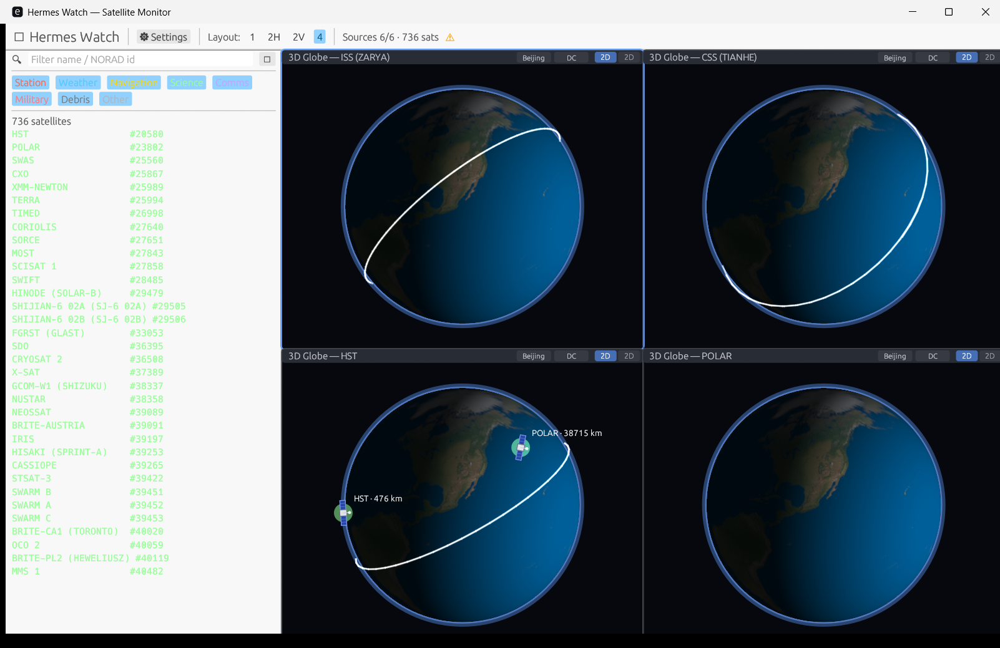

<div align="center">

# 🪽 Hermes Watch（赫尔墨斯之眼）

**Rust 原生桌面卫星监控 — 希腊神话中的信使赫尔墨斯，替你守望天穹。**

[](https://www.rust-lang.org)
[](#)
[](#)

[English](README.md)

</div>

---

希腊神话中，**赫尔墨斯（Hermes）**脚踏飞鞋、头戴翼帽，是众神的信使、旅者与天空的守护神。*Hermes Watch* 把这个角色交给你的桌面：启动即抓取公开 TLE 轨道数据，用 SGP4 推演每颗卫星的轨道，并实时渲染整个星座。


*<p align="center">3D 地球窗格 — 贴图地球上的实时 SGP4 轨道</p>*

---

## ✨ 功能

- 🌐 **全网数据源** — 启动即从 Celestrak 并行拉取 6 个分组（约 18 000 个目标），每 2 小时自动刷新
- 🛰 **SGP4 轨道推演** — 完整 SGP4/SDP4 模型，TEME → 大地坐标转换，星下点与地面轨迹（过去 45 分钟 → 未来 90 分钟）、真实惯性系（ECI）轨道椭圆
- 🖥 **原生 UI** — egui/eframe（glow 渲染器），非 Web 技术栈、非 Electron；GPU 贴图旋转地球，含昼夜晨昏线
- 🪟 **分屏多窗格** — 1 / 2H / 2V / 4 个独立视口，每个窗格有独立相机与目标卫星
- 🔍 **目录侧栏** — 按名称 / NORAD 编号全文搜索 + 按分组（着色）过滤
- 🗺 **四种视图** — 3D 地球 · 世界地图 · 地面轨迹 · 详情 — 每个窗格可独立切换

## 🗺 视图说明

每个窗格可独立渲染以下四种视图之一：

| 视图 | 内容 |
|---|---|
| **3D 地球** | GPU 贴图旋转地球，含昼夜晨昏线；3D 空间中的卫星标记与选中卫星的完整 ECI 轨道椭圆。拖拽旋转相机，滚轮缩放。 |
| **世界地图** | 2D 等距圆柱投影地图，显示目录中全部卫星的当前星下点，按分组着色。 |
| **地面轨迹** | 选中卫星的地面轨迹 — 过去 45 分钟（渐隐）→ 未来 90 分钟，附星下点与覆盖圈。 |
| **详情** | 选中卫星的实时轨道要素：经纬度/高度、速度、周期、倾角、历元时龄及原始 TLE 文本。 |

## 🪟 分屏布局

通过工具栏切换工作区布局：

- **1** — 单个全区域视口
- **2H / 2V** — 两窗格左右 / 上下排列
- **4** — 四象限布局

每个窗格各自保留自己的视图类型、相机状态与目标卫星，例如可以在一个窗格看 3D 地球、另一个窗格同时看地面轨迹。

## 🚀 构建与运行

```sh
cargo run --release
```

> 需要 stable Rust 工具链（Windows 上为 MSVC target）。首次构建需数分钟，之后增量编译很快。

### 首次启动

启动后立即并行抓取全部 6 个 Celestrak 分组。抓取期间状态栏显示进度（已完成源数 / 总数、目标数）。若某个源失败（网络受限、超时），错误会显示在状态栏，其余源正常加载。

### 网络说明

- 请求发往 `celestrak.org`，带浏览器风格 `User-Agent`（裸客户端会收到 HTTP 403）。
- 可在**工具栏设置对话框**中配置 HTTP(S) 代理，修改后下次刷新生效。未在 UI 中设置代理时，回退使用 `SAT_PROXY` 环境变量（如 `SAT_PROXY=http://127.0.0.1:7890`）。

## 🏛 架构

```
┌─────────────┐    mpsc channel     ┌──────────────┐
│  tokio RT   │ ──────────────────▶ │   egui App   │
│  抓取服务    │   FetchMsg::Done    │  (UI 线程)    │
└──────┬──────┘                     └──────┬───────┘
       │ HTTP (Celestrak)                  │ 读取
       ▼                                   ▼
  TLE 文本解析              Arc<RwLock<catalog>> / Arc<RwLock<status>>
                                             │
                                             ▼
                                    每帧 SGP4 推演
                                    (orbit.rs, 带缓存)
```

- **`main.rs`** — 构建 4 工作线程 tokio runtime、共享 `Arc<RwLock>` 状态、启动 eframe。
- **`data/fetch/`** — 数据源列表（6 个 Celestrak 端点）+ TLE 解析；`FetchConfig` 携带可选代理。
- **`service.rs`** — 每个源一个任务；完成的源以 `FetchMsg` 发给 UI 并合并进目录。
- **`orbit.rs`** — SGP4 封装：推演 TEME 状态向量、转大地经纬高、生成地面轨迹与 ECI 轨道折线（按历元缓存，保证 UI 60 fps）。
- **`ui/`** — `app.rs` 管理状态、工具栏、侧栏与分屏；`panes.rs` 绘制窗格边框；`views/` 实现四种渲染器。

## 📁 目录结构

```
src/
├── main.rs            入口：async runtime + eframe 启动
├── data/
│   ├── model.rs       Sat / SatGroup 类型、TLE 结构
│   └── fetch/         Celestrak 数据源、HTTP 客户端、TLE 解析
├── orbit.rs           SGP4 推演、TEME → 大地坐标转换
├── service.rs         后台抓取服务（tokio）
└── ui/
    ├── app.rs         应用状态、工具栏、侧栏、分屏布局
    ├── panes.rs       窗格布局与边框
    └── views/
        ├── globe3d.rs       3D 贴图地球（含测试）
        ├── world_map.rs     2D 等距圆柱地图
        ├── ground_track.rs  地面轨迹渲染
        ├── detail.rs        轨道要素检查器
        └── catalog.rs       侧栏列表与过滤
```

## 🔧 常见问题

| 现象 | 可能原因 / 处理 |
|---|---|
| 状态栏报源错误，卫星很少或为空 | 当前网络无法直连 Celestrak — 在工具栏设置代理（或设 `SAT_PROXY`）后刷新 |
| 错误中出现 HTTP 403 | 客户端被拒 — 应用已带浏览器 UA，可能仍需走代理 |
| 地球/地图空白但侧栏有卫星 | 推演历元过旧 — 等待下次 2 小时自动刷新，选择历元较新的卫星 |
| Linux 构建失败 | 安装 X11/Wayland 开发库（eframe 的 `x11`/`wayland` feature） |

## 📜 许可证

MIT
